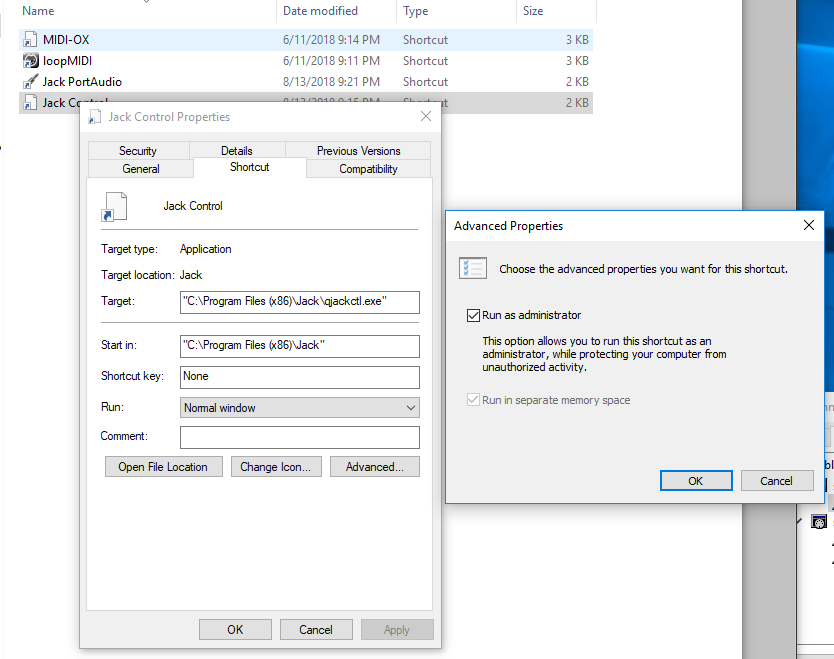
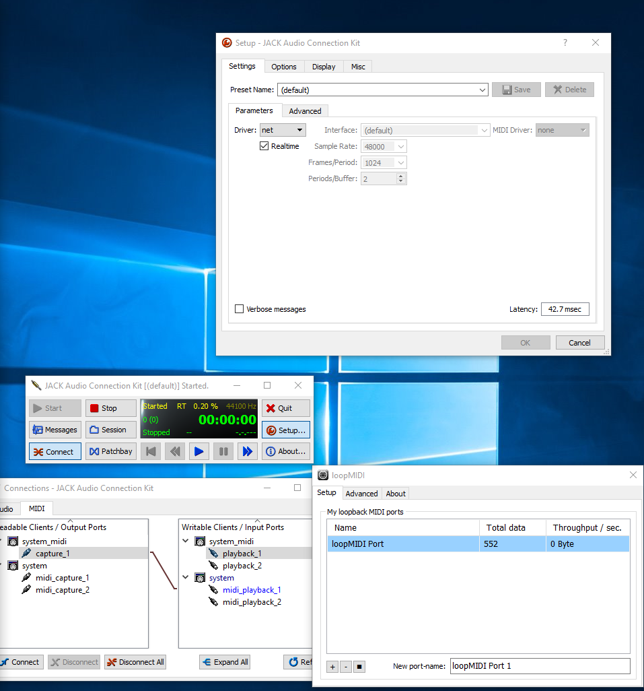

Communication
=============

Structure
---------

There are multiple communication/output channels in order to save or communicate the played xylophone notes:

MidiBridge
^^^^^^^^^^
	Live local Midi Output of the Xylophone notes. The Midi note Velocity is static.
	The **MidiBridge** GameObject is used to configure the **Midi Device Number** and the **Midi Channel**.
	`Jack2 <https://github.com/jackaudio/jack2>`_ can be used to transport the Midi Data via Ethernet to another device (see Jack2 Network Setup).

	.. image:: _static/midi_bridge.png
	 :alt: MidiBridge GameObject

MidiRecording
^^^^^^^^^^^^^
	Writes the Midi NoteOn and NoteOff events of the xylophone to a Midi file.
	The recording can be started and stoped inside the VR environment.
	Via the **MidiRecording** GameObject the **Midi File Path** and the option to overwrite this file can be set.

	.. image:: _static/midi_recording.png
		:alt: MidiRecording GameObject

ROSBridge
^^^^^^^^^
	ROS Message (/roboy/control/musicalNote) sent in a Subscriper/Publisher fashion.
	The message is sent when the note is triggered and just contains the note as Midi Integer representation and the UNIX time in Milliseconds when it was played.

	.. image:: _static/ROS_messages.jpg
		:alt: ROS Midi messages

Jack2 Network Setup
-------------------

In the following subsections it's explained how you can use the local Midi Output of the MidiBridge and send it to other computers with Jack2.
In this guide Jack is being used as a shortcut for Jack2.
To be more specific `Netjack2 <https://github.com/jackaudio/jackaudio.github.com/wiki/WalkThrough_User_NetJack2>`_ which is a module of Jack2 is used for our Midi Network Setup.

Requirements
^^^^^^^^^^^^
- LAN with Multicast Support (IGMP Snooping and IGMP Querier)
- two computers capable of running a Jack2 server

Setup Steps
^^^^^^^^^^^^

In this example we're using a Linux machine as the Jack Server and a Windows machine with Unity and the HTC Vive as a Jack Client.

Install Jack2 and the needed tools with the following commands::

	sudo apt-get update
	sudo apt-get install jackd2 qjackctl

For better performance add your user to the audio group which has elevated rights for realtime audio enhancing features.
How to do this in Ubuntu is explained `here <https://wiki.ubuntuusers.de/Tonstudio/Konfiguration/>`_.

Use the following commands to start the Jack2 Server on the receiving side of your network setup with Linux::

	jackd -r -d alsa -r 44100
	#start the following programm in another terminal or in the programm launcher
	qjackctl
	#in another terminal start the following to load/unload the netjack2 module
	jack_load netmanager
	jack_unload netmanager

The following tools might also be of interest for different purposes:
- `Qsynth <https://qsynth.sourceforge.io/>`_ can be used as a Synthesizer to play sounds of the received Midi notes
- `Gmidimonitor <https://packages.ubuntu.com/source/bionic/gmidimonitor>`_ can be used as a Midi Monitor to visualize the received Midi notes
- `a2jmidid <https://packages.ubuntu.com/de/bionic/a2jmidid>`_ can be used as a alsa midi to jack midi bridge for software which doesn't natively support jack

The following picture shows all the launched programms:

In the qjackctl window (JACK Audio Connection Kit) press the Connect button when the Client is connected and connect the Clients Midi Output (DESKTOP-GDGAKV4 in the Screenshot) with your desired Midi Application like Qsynth or Gmidimonitor.

To install the client side of Jack and its tools on windows use `this guide <http://jackaudio.org/faq/jack_on_windows.html>`_.

To be a 100 percent sure we launched qjackctl.exe as Administrator, but maybe this step is not even needed.

After that the Jack Server was configured with the following parameters:
.. image:: _static/jackd_screenshots/jackd_settings_2.PNG
	:alt: Jack2 Windows parameters

In the previous screenshot you could also see how we used the `loopMIDI midi loopback driver <http://www.tobias-erichsen.de/software/loopmidi.html>`_ as an readable client (capture_1) and send it to a writable client (system > midi_playback_1 - the Linux Jack Server).

ROS Cheatsheet
--------------

This was used for debugging/demo purposes to see the Midi messages::

	cd path/to/Roboy
	source devel/setup.bash
	rostopic list
	rostopic echo /roboy/control/musicalNote

Current State
-------------

Sofar there are three ways of communication/output via ROSBridge, MidiRecording and via MidiBridge.

The ROS Messages are pretty basic sofar and can be extended if needed.
We didn't extend the ROS approach as the Jack2 approach seems to have a better performance as Jack2 is based on UDP packets and not on TCP packets like ROS with the Unity ROSBridge.

Jack2 could probably be integrated more tightly on a library level in Unity and not just on a programm level which uses the Midi Data coming from the MidiBridge as Input.