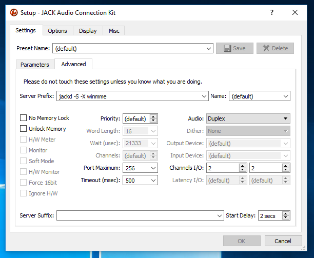

Communication > Jack2 Network Setup
===================================

In the following subsections it's explained how you can use the local Midi Output of the MidiBridge and send it to other computers with Jack2.
In this guide Jack is being used as a shortcut for Jack2.
To be more specific `Netjack2 <https://github.com/jackaudio/jackaudio.github.com/wiki/WalkThrough_User_NetJack2>`_ which is a module of Jack2 is used for our Midi Network Setup.

Requirements
------------
- LAN with Multicast Support (IGMP Snooping and IGMP Querier)
- two computers capable of running a Jack2 server

Setup Steps
-----------

In this example we're using a Linux machine as the Jack Server and a Windows machine with Unity and the HTC Vive as a Jack Client.

Linux Jack Server
^^^^^^^^^^^^^^^^^

Install Jack2 and the needed tools with the following commands::

	sudo apt-get update
	sudo apt-get install jackd2 qjackctl

For better performance add your user to the audio group which has elevated rights for realtime audio enhancing features.
How to do this in Ubuntu is explained `here <https://wiki.ubuntuusers.de/Tonstudio/Konfiguration/>`_.

Use the following commands to start the Jack2 Server on the receiving side of your network setup with Linux::

	jackd -r -d alsa -r 44100
	#start the following programm in another terminal or in the programm launcher
	qjackctl
	#in another terminal start the following to load/unload the netjack2 module
	jack_load netmanager
	jack_unload netmanager

The following tools might also be of interest for different purposes:

- `Qsynth <https://qsynth.sourceforge.io/>`_ can be used as a Synthesizer to play sounds of the received Midi notes
- `Gmidimonitor <https://packages.ubuntu.com/source/bionic/gmidimonitor>`_ can be used as a Midi Monitor to visualize the received Midi notes
- `a2jmidid <https://packages.ubuntu.com/de/bionic/a2jmidid>`_ can be used as a alsa midi to jack midi bridge for software which doesn't natively support jack

The following picture shows all the launched programms:

.. image:: _static/jackd_screenshots/jackd_screenshot_linux.png
	:alt: running Jack Server in Linux

In the qjackctl window (JACK Audio Connection Kit) press the Connect button when the Client is connected and connect the Clients Midi Output (DESKTOP-GDGAKV4 in the Screenshot) with your desired Midi Application like Qsynth or Gmidimonitor.

Windows Jack Client
^^^^^^^^^^^^^^^^^^^

To install the client side of Jack and its tools on Windows use `this guide <http://jackaudio.org/faq/jack_on_windows.html>`_.

To be a 100 percent sure we launched qjackctl.exe as Administrator, but maybe this step is not even needed.

.. image:: _static/jackd_screenshots/jackd_settings_3.PNG
	:alt: launch qjackctl.exe as administrator

After that the Jack Server was configured with the following parameters:

.. image:: _static/jackd_screenshots/jackd_settings_1.PNG
	:alt: Jack2 Windows parameters and the running status of jack

In the previous screenshot you could also see how we used the `loopMIDI midi loopback driver <http://www.tobias-erichsen.de/software/loopmidi.html>`_ as an readable client (capture_1) and send it to a writable client (system > midi_playback_1 - the Linux Jack Server).