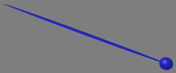

Environments
=============

Surrounding Objects
------------
This section would describe the xylophone playing environment in VR and how to interact with that both on users and developer view.

**Notes:**

- When You start the program it will automatically transform the center of all objects coordinate to the HTC Vive glass position.
- Both Controller should be activated.

Developer view
^^^^^^^^^^

Every Object inside the starWars object are under StarWarsObject unity object, except for the sticks which are under CameraRig. 
Objects movement inside starwars environment are defined in MovingObjectsInStarWarsSkyBox.cs. 
And if you want to add an object which you want to move like tieFighters or xwing just put it inside StarWarsObject or if you want add more laser-bolt 
create your objects inside StarWarsObject and assign laserBolt tag for them. 

Controllers
---------

In the VR you can play xylophone with different sticks which each one of them produce different sound, for example the Lightsaber stick would create 
more electronic xylophone sound and the normal stick would create classical xylophone sound. 

For changing sticks model in VR you have to press Grip button of vive controller (button number 8 in the picture) then a menu which contains 3 controller model,
 would appear. You can choose each model with controller trackpad (button number 2 in picture). The controller would disappear as soon as you do not touch the trackpad.

.. image:: _static/vive_controllers.jpg
  :width: 400
  :alt: normal stick

Developer view
^^^^^^^^^^

If you want to add new controller model you should add the model at position (0,0,0) in both controller(Controller (left) and Controller (right)) 
object inside cameraRig in unity. Also you have to add the model picture in controller menu so users could be able to change the sticker to that model. 
For modifying the controller menu functionality you have to change controller.cs .

If you want to change the song for each note when changing the stick, you have to modify 
StarWarsObjects/Self/Xylophone/KeyManager/XylophoneKeyWrapper##/XylophoneKeyCollider. First Audio source is for the normal stick, 
second one is for the stick which had Roboy head on that, and the third one is for Lightsaber.

