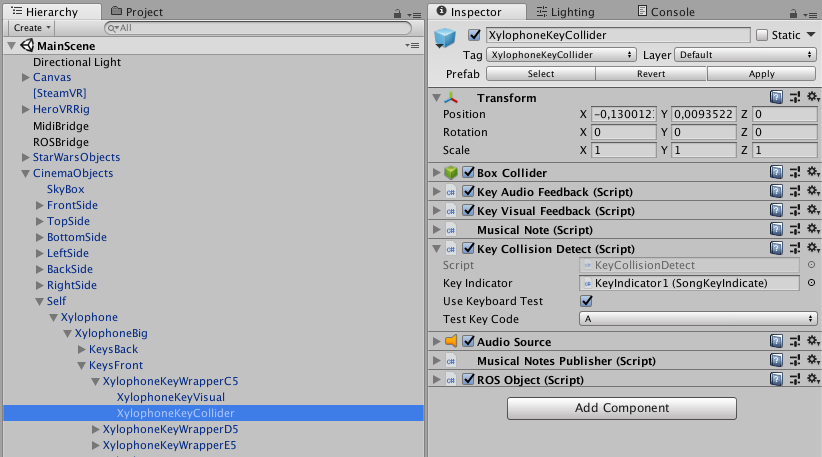

Getting Started
====================

This section explains how to install the project and later on which steps have to be done when you want to execute the program.

Installation
--------------------

Requirements
~~~~~~~~~~~~~~~~~~~~~~~~~

We suggest to use Windows as a development system as the used HTC Vive is officially just `supported on Windows <https://www.vive.com/de/ready/>`_.
Nevertheless it's possible to run the Unity project without the HTC Vive for debugging purposes.
This is also possible with other operating systems like Mac OSX.

Part 1: Install Unity
~~~~~~~~~~~~~~~~~~~~~~~~~

The Xylophone Recording Project is developped and tested in Unity.
Take a look at the **ProjectSettings/ProjectVersion.txt** file to see what Version of Unity is currently used for the Project.
Any Versions later than this should be compatible with this project.
Using earlier versions should be avoided, because it may cause "missing prefab" and other problems.

Specific Unity Versions can be downloaded here: `Unity Download Archive <https://unity3d.com/get-unity/download/archive>`_

Select the correct version and download the installer.
After downloading, run the installer and follow the instructions to install Unity.

Part 2: Setup HTC Vive and SteamVR
~~~~~~~~~~~~~~~~~~~~~~~~~~~~~~~~~~~~~~~~~
Follow the official `SteamVR HTC Vive PRE installation Guide <https://support.steampowered.com/kb_article.php?ref=2001-UXCM-4439>`_ to set up HTC Vive and SteamVR.

Part 3: Clone the project from Github
~~~~~~~~~~~~~~~~~~~~~~~~~~~~~~~~~~~~~~~~~
Use the following command in Git Bash or your preffered command line to clone the Xylophone Recording repository from Github::

	git clone git@github.com:Roboy/ss18_xylophone_recording.git

Part 4: Setup ROS
~~~~~~~~~~~~~~~~~~
This is just one way of installing ROS for Roboy.
There are probably more suited approaches which are more elegant.
But this one worked for us.
ROS can be installed on another computer then were Unity is installed.

Install ROS like described in the `Roboy repository <https://github.com/Roboy/Roboy>`_.

Change to the Roboy directory and checkout our `branch <https://github.com/Roboy/roboy_communication/tree/ss18_xylophone_recording>`_ of the roboy_communication repository::

	cd path/to/Roboy/src/roboy_communication
	git checkout ss18_xylophone_recording

If you just want to run our program you can move all the other submodules/folders inside src (everything except CMakeLists.txt and roboy_communication) to another folder outside src so that they won't be built::
	
	cd path/to/Roboy
	mkdir donotbuild
	mv src/common_utilities donotbuild
	...

Build the project::

	source devel/setup.bash
	catkin_make

Starting the Program
--------------------

Step 1: Launch ROSBridge Server
~~~~~~~~~~~~~~~~~~~~~~~~~~~~~~~

Before running the Unity Project launch the ROSBridge Server on a device which has ROS installed like this::

	source path-to-roboy-repo/devel/setup.bash
	roslaunch rosbridge_server rosbridge_websocket.launch

Step 2: Check for an available Midi Device
~~~~~~~~~~~~~~~~~~~~~~~~~~~~~~~~~~~~~~~~~~

Check if you have any available Midi Devices. This can be done by using a Midi Management/Monitoring tool like `Midi-OX (Windows) <http://www.Midiox.com/>`_. In Midi-OX use Options > Midi Devices to see the current Midi Devices available.

An Alternative for MacOSX would be `MIDIMonitor <https://www.snoize.com/MIDIMonitor/>`_.

Note down the Midi Device Number of your prefered Midi Output as you need it later on.

If you don't have a local Midi Device you can use a loopback Driver like `loopMIDI (Windows) <http://www.tobias-erichsen.de/software/loopMidi.html>`_ for testing purposes.
On MacOSX you can use the `this guide <https://help.ableton.com/hc/en-us/articles/209774225-Using-virtual-MIDI-buses>`_ to setup a loopback Driver.

**If you want to send Midi over the network to another computer in an efficient manner check out the "Communication > Jack2 Network Setup" chapter as the setup for this is not trivial!**

Step 3: Launch Unity
~~~~~~~~~~~~~~~~~~~~

Launch Unity and check the GameObjects MidiBridge for the correct Midi Device Number which you wrote down earlier and your desired Midi Channel.

.. image:: _static/GameObject_MidiBridge.png
		:alt: GameObject MidiBridge

Check the GameObject ROSBridge for the correct ROS Core IP (computer where you started the ROSBridge Server) and Port.

.. image:: _static/GameObject_ROSBridge.png
		:alt: GameObject ROSBridge

Debugging
---------

In the Unity Xylophone model we added debugging support for playing the xylophone without having a HTC Vive at hand.
You can set a computer keyboard key to a xylophone key in the **XylophoneKeyCollider** GameObject.

