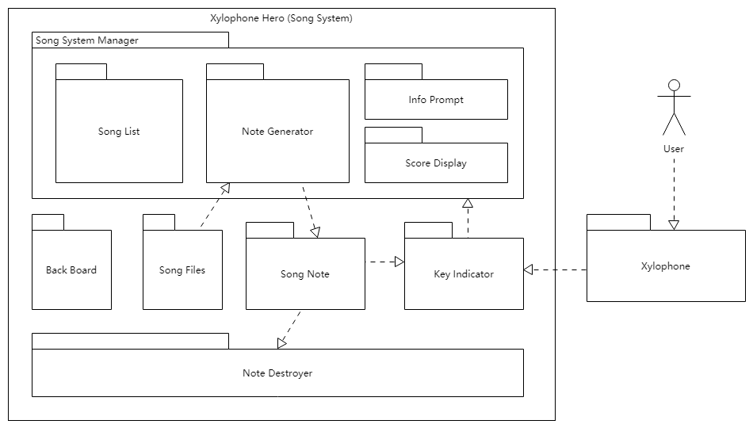

Song System (Xylophone Hero)
================================

Motivation and Introduction
--------------------------------

When the user is playing the xylophone in virtual reality, he may sometimes feel at a loss and don't know what to play. Therefore, we decided to add a song system, which can tell the user which note should he/she play and when to play. Furthermore, we considered that some gaming features can be added to the system, such as a score system and more fancy visual effects.

Inspired by the famous video game serious Guitar Hero, we name our song system Xylophone Hero.

Structure
--------------

The Song System, aka. Xylophone Hero, consists of 4 Parts: song system manager, key indicator, note destroyer and back board. It reads song files from the disk and generate in game playable songs. Users interact with the song system through the xylophone. Details are described below.

Song File
~~~~~~~~~~~

The song files are not actual audio recordings of the song (``.mp3``, ``.wav``, etc.). They contain only the sequences of the notes which will be used to generate the notes in the song system. The format is inspired by the ``.sm`` file of `StepMania <https://www.stepmania.com/>`_ which looks as follows::

	1000000
	0000000
	0000000
	0100000
	0010000
	0000000
	0000000
	1000000

Each line represents one beat. There are 7 keys in the xylophone now so each row has 4 digits, each one corresponds to one key. 1 means this key should be played on this beat, 0 means it should not. So the note generator can generate the notes of the song according to this song file.

Song System Manager
~~~~~~~~~~~~~~~~~~~~~

Song system Manager is the most important and core part of the song system. It consists of 4 parts: note generator, song list, info prompt and score display. It manages the state of the song system, display useful information, and generate the notes of songs. 

Note Generator
^^^^^^^^^^^^^^^^^^

Just as its name indicates, the note generator generates the notes according to the song file. It reads the song file from the designated path, then starts a coroutine, which respawns the notes at a certain rate according to the set BPM (Beats Per Minute). The notes would then fall down. When they reach the corresponding key indicator, the User should play the key.

Song List
^^^^^^^^^^^^^^^^^

After the note generator loads the song, the song list would display the titles of the songs. *This function is still work in progess*. 

Info Prompt and Score Display
^^^^^^^^^^^^^^^^^^^^^^^^^^^^^^^

The Xylophone Hero has a score system. If the user play the correct key at the right time, he/she gains 10 points. If he/she manages to do that continuously, this is called combos. Combos gains more points. The points the user gains and some prompts are displayed in info prompt and score display section.

Note Destroyer
^^^^^^^^^^^^^^^^

The Note Destroyer destroys all game objects with the tag ``SongNote`` which enter its trigger zone. This basically "cleans up" the notes that are not played by the user.

Usage
--------------

Xylophone Hero is hidden in the scene by default. to activate it, press the ``menu`` button on the Vive controller. To disable it, press the ``menu`` button again.

Current State
----------------------

The song system is playable. It can load one song from the designated path and generate the song.